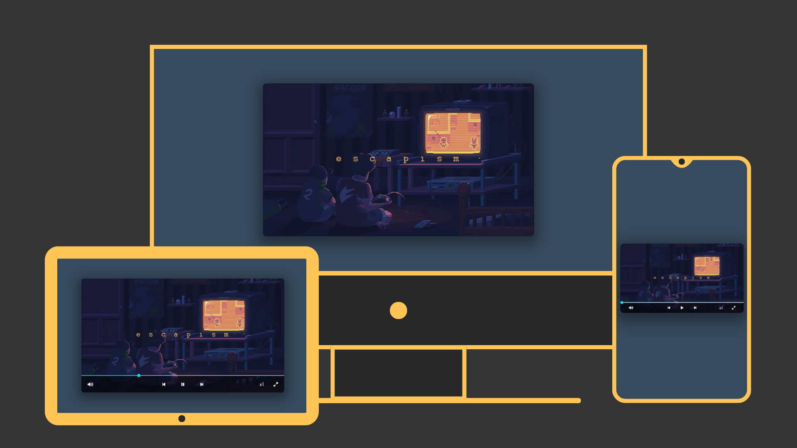

# 🎬 Custom Video Player

A clean and functional custom video player built with pure HTML, CSS, and JavaScript. Includes all essential controls with a smooth and modern user interface.

## 🌟 Features

- ▶️ Custom play/start button
- ⏩ 5-second forward & backward skipping
- 🔊 Volume adjustment
- 🖥️ Fullscreen toggle
- 🚀 Video speed control
- 🎨 Clean and responsive design

## 💻 Tech Stack

- HTML  
- CSS  
- Vanilla JavaScript

## 🚀 Live Demo

Try it here 👇  
https://zeddy-foreal.github.io/custom-video-player

## 📸 Preview



## 📁 How to Run Locally

```bash
git clone https://github.com/zeddy-foreal/custom-video-player.git
cd custom-video-player
# Then open index.html in your browser

